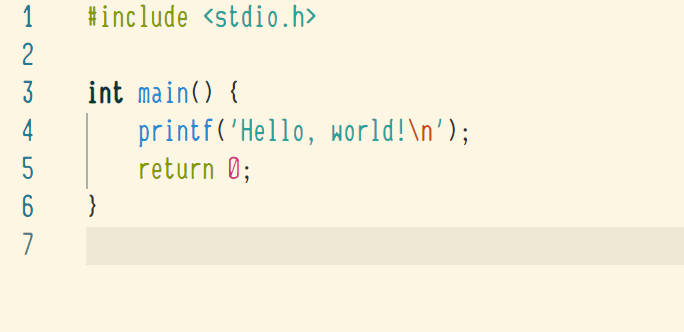
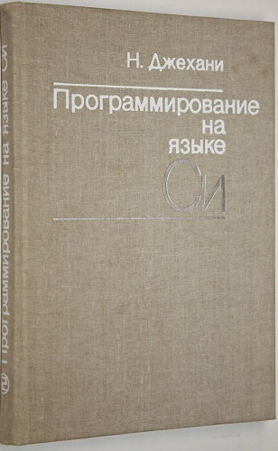

# Narain, a monospace font

## What is it?

It's a compact monospace font, similar to [Anka/Coder Narrow](https://fontlibrary.org/en/font/anka-coder-narrow), and supporting the basic ASCII character set (eventually also Cyrillic).

Still left to do:

- Clean up ascender and descender caps
- Ensure consistent width for all stems
- Tweak spacing to avoid optical gaps
- Add more characters

Check out the [Releases page](https://github.com/cmihai/narain/releases/) for downloads.

## Background (you can skip this)

The first C book I randomly found in our attic was the Soviet 1988 edition of "C: An advanced introduction" by Dr. Narain Gehani. It taught K&R C in a solid and boring manner, and didn't catch my interest much. One thing I remember though, even decades later, was the quirky monospace font the printer used for the code samples. Databases like WhatTheFont didn't seem to have it, since it was likely developed by the Soviet print house.

In the end, to close the gestalt, I downloaded FontForge, opened my scan of the book and got to tracing. Even at higher resolutions the letters were quite pixelated (random ink smudges didn't help), so the result is 60% traced, 30% guesswork and 10% my own aesthetic judgement. Please enjoy, if you can.

Dr. Gehani most definitely had nothing to do with the original font, but he inspired me to name this one "Narain". It's one of the names of the Hindu god Vishnu, I think. Pretty metal.

## License

The font is licensed under the [SIL Open Font License](https://scripts.sil.org/cms/scripts/page.php?site_id=nrsi&id=OFL).
