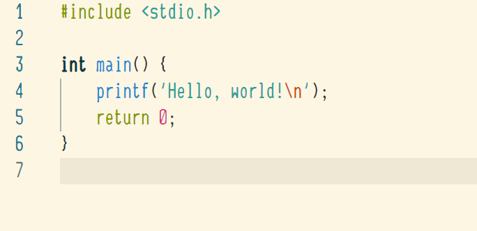
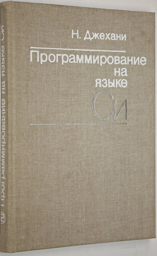

# Narain, a monospace font

## What is it?

It's a compact monospace font, similar to [Anka/Coder Narrow](https://fontlibrary.org/en/font/anka-coder-narrow), and supporting the basic ASCII character set (eventually also Cyrillic).

## Version 0.5

- Fixed stroke widths for geometrically-constructed glyphs (П, Д, Ъ, ъ) to match the traced glyphs' 65-unit bold monospace weight.
- All constructed glyphs now have consistent visual weight with the 27 correctly-traced Cyrillic letters.

## Version 0.4

- Completed the Cyrillic alphabet: 64 codepoints covering the full Russian alphabet plus Ё.
- Added 24 constructed glyphs for missing letters (ж х ш ъ ы э я, Д П Ф Г Ж З Й Л Ц Ч Щ Ъ Ы Ь Э Ю Я Ё), built from verified traced components to preserve the font's curves and angles.
- `Narain-Regular.ttf` rebuilt from the updated source.

Still left to do:

- Ensure consistent stem widths across constructed glyphs (Г, П, Д, Ъ need stroke width matching)
- Tweak spacing to avoid optical gaps
- Fix 3 mis-traced glyphs (ь shows as H, к as Latin K, д as capital Д)

## Version 0.3

- Added 41 Cyrillic glyphs: 30 traced from the 1988 Soviet edition's monospace code font (lowercase а-я except ж х ш ъ ы э я, uppercase Б И О У Ш), plus 11 Latin-lookalike aliases (А В Е К М Н О Р С Т Х).
- Traced glyphs are centered in the 470-unit cell with proper x-height (588), cap line (820), and descenders (-204).
- `Narain-Regular.ttf` rebuilt from the updated source.

Still left to do:

- Ensure consistent width for all stems (needs redrawing by hand, not automation)
- Tweak spacing to avoid optical gaps
- Add remaining Cyrillic letters (ж х ш ъ ы э я and more capitals)

## Version 0.2

- Cleaned up 31 glyphs in `Narain-fixed.sfd`: capitals, digits and ascenders share one cap line, lowercase letters share an x-height, baselines and descender depths normalized. Every glyph keeps its 470-unit advance.
- `Narain-Regular.ttf` is an installable build generated from the fixed source.

Still left to do:

- Ensure consistent width for all stems (needs redrawing by hand, not automation)
- Tweak spacing to avoid optical gaps
- Add more characters (eventually Cyrillic)

Check out the [Releases page](https://github.com/cmihai/narain/releases/) for downloads.

## Background (you can skip this)

The first C book I randomly found in our attic was the Soviet 1988 edition of "C: An advanced introduction" by Dr. Narain Gehani. It taught K&R C in a solid and boring manner, and didn't catch my interest much. One thing I remember though, even decades later, was the quirky monospace font the printer used for the code samples. Databases like WhatTheFont didn't seem to have it, since it was likely developed by the Soviet print house.

In the end, to close the gestalt, I downloaded FontForge, opened my scan of the book and got to tracing. Even at higher resolutions the letters were quite pixelated (random ink smudges didn't help), so the result is 60% traced, 30% guesswork and 10% my own aesthetic judgement. Please enjoy, if you can.

Dr. Gehani most definitely had nothing to do with the original font, but he inspired me to name this one "Narain". It's one of the names of the Hindu god Vishnu, I think. Pretty metal.

## License

The font is licensed under the [SIL Open Font License](https://scripts.sil.org/cms/scripts/page.php?site_id=nrsi&id=OFL).
